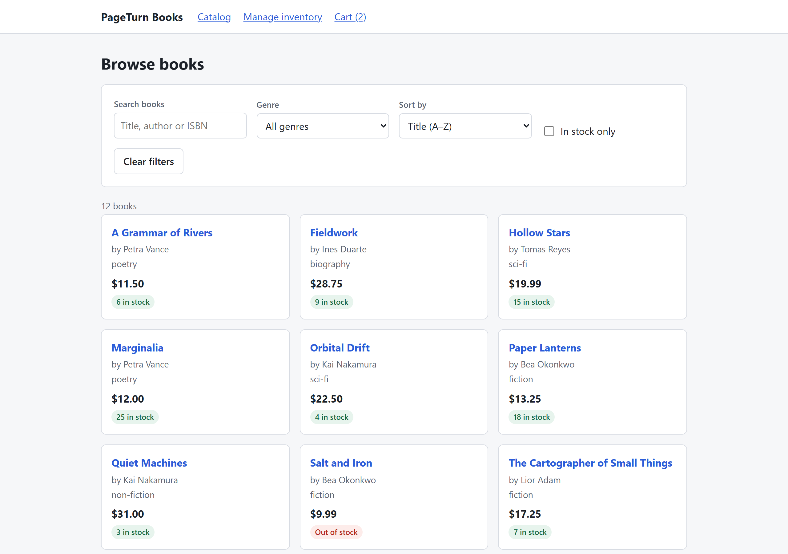
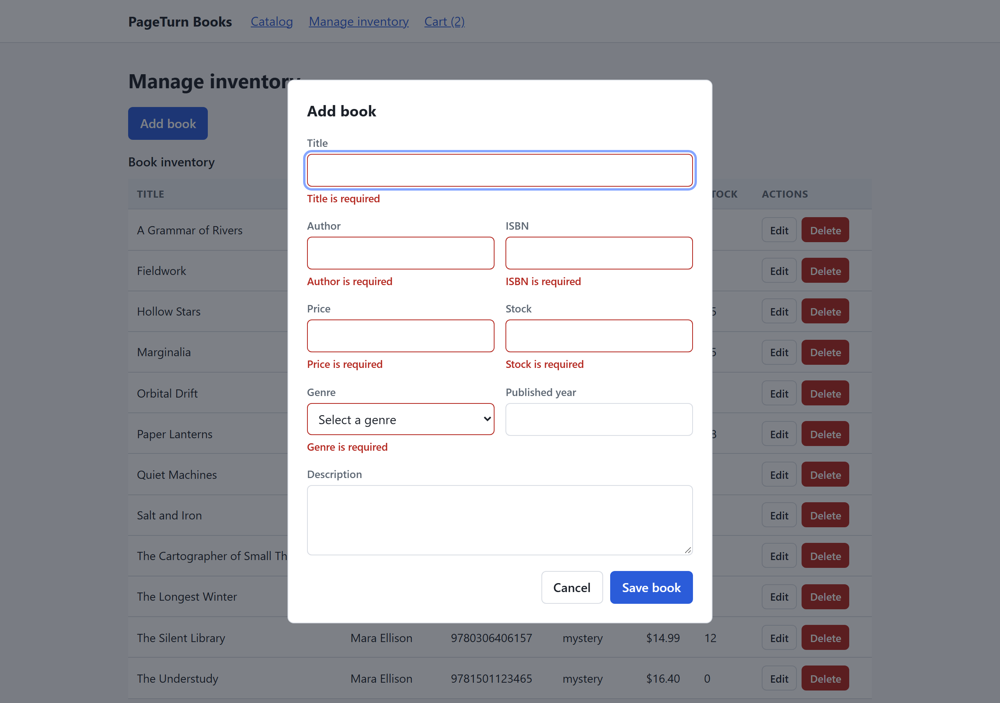

# Playwright Automation Portfolio

[](https://github.com/SaadiIftikhar/playwright-automation-portfolio/actions/workflows/tests.yml)

A Playwright test automation project covering both UI and API testing, built
against a demo bookstore application that ships inside this repository.

Clone it, run two commands, and the whole thing works — application and tests
together. Nothing points at an external environment that might be down or
different tomorrow.

**221 test cases** — 104 UI and 117 API — running on Chromium, Firefox and
WebKit, green in CI on every push and pull request.

📊 **[Browse the latest test report](https://saadiiftikhar.github.io/playwright-automation-portfolio/)** — published from `main`, no clone required.



---

## Quick start

**You need:** [Node.js](https://nodejs.org) 20 or newer (this repo is built on
24; `.nvmrc` pins the CI version) and Git. Nothing else — no database, no Docker,
no accounts, no environment variables.

```bash
git clone https://github.com/SaadiIftikhar/playwright-automation-portfolio.git
cd playwright-automation-portfolio

npm run setup     # installs dependencies and the three browsers
npm test          # runs the UI suite, then the API suite
```

`npm run setup` is `npm ci` followed by `npx playwright install --with-deps`.
Both steps are needed: **`npm ci` alone does not download browsers**, which is
the most common reason a fresh clone fails to run.

The first run downloads roughly 500 MB of browser binaries and takes a few
minutes. Everything after that is quick — the UI suite finishes in about 22
seconds and the API suite in under 3.

You do not need to start the application yourself. Playwright's `webServer`
starts it before the tests and shuts it down afterwards. To browse it by hand:

```bash
npm start         # http://127.0.0.1:3000
```

### Commands

| Command                                       | What it does                                 |
| --------------------------------------------- | -------------------------------------------- |
| `npm test`                                    | Both suites, one after the other             |
| `npm run test:ui`                             | UI suite on all three browsers               |
| `npm run test:ui:chromium`                    | UI suite on Chromium only — fastest feedback |
| `npm run test:ui:core`                        | Just the `@core` journeys                    |
| `npm run test:ui:headed`                      | Watch the tests drive a real browser         |
| `npm run test:ui:ui`                          | Playwright's interactive UI mode             |
| `npm run test:api`                            | API suite — no browser needed                |
| `npm run report:ui` / `report:api`            | Open the last HTML report                    |
| `npm run lint` · `format:check` · `typecheck` | The checks CI runs                           |
| `npm start` · `npm run dev`                   | Run the demo app by itself                   |

Run a single documented case by its ID:

```bash
npm run test:ui -- --grep BK-003
npm run test:api -- --grep API-049
```

### If something goes wrong

| Symptom                                        | Cause and fix                                                                          |
| ---------------------------------------------- | -------------------------------------------------------------------------------------- |
| `browserType.launch: Executable doesn't exist` | Browsers were not installed. Run `npx playwright install --with-deps`.                 |
| `EADDRINUSE` on port 3000                      | Something else holds the port. Free it, or run on another: `PORT=3100 npm test`.       |
| `npm ci` fails on lockfile mismatch            | Your Node is older than 20. Check with `node --version`.                               |
| WebKit fails to start on Linux                 | Missing system libraries. Run `npx playwright install-deps`.                           |
| Tests pass locally, fail in CI                 | CI runs with `retries: 2` and fewer workers. Reproduce with `CI=true npm run test:ui`. |

---

## What is being tested

**PageTurn Books** — an Express API over an in-memory store, with a
vanilla-JavaScript frontend. No framework, no build step, so the repository is
about the tests rather than about a toolchain.

Four views: a **catalog** with debounced search, filtering and sorting; a **book
detail** page with a delayed add-to-cart; an **inventory manager** with a
validated create/edit dialog and delete confirmation; and a **cart**.

The application was written to contain the things worth automating — validation
rules at boundaries, async flows with real loading states, empty states,
out-of-order responses — rather than to be a product.

| Method                | Endpoint                       |                                                                        |
| --------------------- | ------------------------------ | ---------------------------------------------------------------------- |
| `GET`                 | `/api/books`                   | `search` `genre` `inStock` `minPrice` `maxPrice` `sort` `page` `limit` |
| `GET`                 | `/api/books/:id`               | 404 when missing                                                       |
| `POST`                | `/api/books`                   | 201 with `Location`                                                    |
| `PUT` / `PATCH`       | `/api/books/:id`               | Full replace / partial update                                          |
| `DELETE`              | `/api/books/:id`               | 204                                                                    |
| `GET` `POST` `DELETE` | `/api/cart`, `/api/cart/items` | Add is deliberately slow, to give the UI a loading state worth testing |
| `POST`                | `/api/test/reset`              | Reseeds the calling tenant only                                        |

Responses use one envelope throughout — `{ data }`, `{ data, meta }` and
`{ error: { code, message, details } }` — which is what makes strict schema
validation worth doing.



---

## How it is built

```
app/
  server/            Express API, validation, tenant-scoped store
  public/            Four views, no framework, no build step
tests/
  shared/            Typed API client, data factories, network gating
  ui/
    pages/           Page objects
    components/      Nav, book form dialog, confirm dialog
    fixtures/        Tenant, API client and page object fixtures
    specs/           8 spec files, 104 cases
  api/
    schemas/         zod contracts and assertion helpers
    fixtures/        Tenant-scoped request fixture
    specs/           6 spec files, 117 cases
docs/                Test cases, strategy, defect log
```

### Every test gets its own database

Running tests in parallel against one shared server usually means resetting
global state between them, which forces tests to run one at a time or to tiptoe
around each other.

Instead, the backend resolves a **tenant** from an `x-test-tenant` header and
hands each one an independent copy of the seed data. A fixture gives every test
a fresh tenant id and applies it to both the browser context and the API client:

```ts
context: async ({ context, tenantId }, use) => {
  await context.setExtraHTTPHeaders({ 'x-test-tenant': tenantId });
  await use(context);
},
```

So every test starts from identical known data, no test can disturb another,
`fullyParallel` is safe everywhere, and there is no teardown to forget.
`API-133` and `API-134` assert the isolation itself. Browsing `localhost` by
hand sends no header and gets the default dataset, so the app stays a normal app.

### Testing async states without sleeping

There is no `waitForTimeout` anywhere, and lint fails the build if one appears.
Assertions that need to observe an in-flight state park the request and release
it from the test:

```ts
const gate = await holdRequests(page, isCartAdd);

await bookDetailPage.addToCart();
await gate.waitUntilHeld();

await expect(bookDetailPage.busyButton).toBeVisible();
await expect(bookDetailPage.busyButton).toBeDisabled();

gate.release();
await expect(bookDetailPage.successMessage).toBeVisible();
```

Nothing depends on a duration, so there is no timeout to tune and nothing to go
flaky on a slow CI runner. The same gate proves that a slow earlier search
cannot overwrite a newer one (`DYN-003`).

### Contracts, not spot-checks

API responses are parsed against strict zod schemas, so an added, removed or
retyped field fails the test instead of slipping past an assertion that only
looked at two keys:

```ts
const body = await expectSchema(response, bookListEnvelopeSchema, 200);
expect(body.meta.total).toBe(SEED.totalBooks);
```

### Role-based locators

`getByRole` and `getByLabel` throughout — the same way a user or a screen reader
finds things, so refactoring markup does not break the suite. Exactly one
`data-testid` exists, on the catalog result count, which has no semantic role of
its own.

The cart count lives inside the link's accessible name, so even that is asserted
by role:

```ts
await expect(this.cartLink).toHaveText(`Cart (${count})`);
```

---

## Coverage

Full case-by-case inventory with IDs: **[docs/TEST-CASES.md](docs/TEST-CASES.md)**

### UI — 104 cases

| Area            | Cases | Covers                                                                                                                                                                                                         |
| --------------- | ----- | -------------------------------------------------------------------------------------------------------------------------------------------------------------------------------------------------------------- |
| Book CRUD       | 6     | Create, read, update, delete end to end; prefilled edit form; delete confirmation and cancellation                                                                                                             |
| Catalog         | 14    | Search by title and author, case-insensitivity, genre and stock filters, sorting both ways, composed filters, singular/plural counts                                                                           |
| Form validation | 20    | Every required field, malformed ISBN, duplicate ISBN via the server, price bounds and precision, non-numeric and fractional input, length limits, error clearing, `role="alert"` and `aria-describedby` wiring |
| Edge cases      | 20    | Min and max boundaries, one past each, emoji, CJK, RTL, accents, markup rendered literally, whitespace trimming, regex metacharacters in search, empty catalog, double-click on save and delete                |
| Dynamic states  | 11    | Loading indicators, debounced typing, out-of-order responses, in-flight button locking, repeated submits, 500 with a working retry                                                                             |
| Cart            | 10    | Add, increment, multi-copy, stock ceiling, remove, clear, count persistence across navigation                                                                                                                  |
| Accessibility   | 14    | axe-core WCAG 2.1 A/AA on five states, keyboard-only creation, landmarks, focus trap and restoration, live-region roles                                                                                        |
| Regression      | 9     | Locked-down fixes for the four logged defects                                                                                                                                                                  |

27 cases are tagged `@core` and also run on Firefox and WebKit — 154 executions per run.

### API — 117 cases

| Area       | Cases | Covers                                                                                                                                                                   |
| ---------- | ----- | ------------------------------------------------------------------------------------------------------------------------------------------------------------------------ |
| Reads      | 17    | List envelope, pagination, every filter, both sort directions, page past the end, single fetch, ISO timestamps                                                           |
| Writes     | 13    | 201 with `Location`, read-after-write, full replace, partial update, timestamp handling, 204 delete                                                                      |
| Validation | 26    | Every required field individually, wrong types, invalid enums, malformed ISBN, duplicate ISBN, malformed JSON, wrong content type, unknown fields, query parameter rules |
| Edge cases | 22    | Boundaries and one past them, empty and whitespace strings, sub-cent precision, unicode, SQL and markup strings, oversized payload, page-size limits                     |
| Cart       | 17    | Full lifecycle, stock ceiling including what is already in the cart, invalid quantities, 404s                                                                            |
| Contract   | 16    | 404 on all four verbs, unknown routes, one error envelope everywhere, JSON content type, health and meta, tenant isolation                                               |

---

## CI

Every push and pull request runs three jobs in parallel:

- **Lint, format and types** — ESLint with the Playwright plugin, Prettier, `tsc --noEmit`
- **API tests** — no browser install at all, so it finishes in under a minute
- **UI tests** — browsers cached by Playwright version

Both suites upload their HTML report as an artifact. Traces and screenshots are
captured **only on failure**, so a green run uploads almost nothing. On `main`,
both reports are published to GitHub Pages behind a small landing page, so the
results can be read without cloning anything.

---

## Documentation

|                                            |                                                                                        |
| ------------------------------------------ | -------------------------------------------------------------------------------------- |
| **[Test cases](docs/TEST-CASES.md)**       | All 221 cases with IDs, traceable to the code                                          |
| **[Test strategy](docs/TEST-STRATEGY.md)** | Scope, risk, isolation design, what is deliberately not automated                      |
| **[Defect log](docs/BUG-REPORTS.md)**      | Four real defects found, with root causes and the regression tests that lock them down |

---

## Built with

Playwright · TypeScript · zod · axe-core · Express · ESLint · Prettier · GitHub Actions

## Licence

[MIT](LICENSE)
